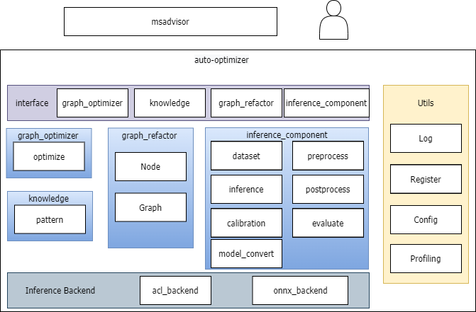

# auto-optimizer

## 介绍

自动调优工具，使能ONNX模型在昇腾芯片的优化，并提供基于ONNX的改图功能。

## 软件架构

软件架构说明



## 组件使用说明

- [x]  [graph_refactor](auto_optimizer/graph_refactor/README.md)
- [x]  [knowledge](docs/knowledge_optimizer_frame.md)
- [x]  [inference_engine](auto_optimizer/inference_engine/README.md)

## 安装教程

```shell
git clone https://gitee.com/ascend/auto-optimizer.git
cd auto-optimizer
pip install -r requirements.txt

# without infer_test feature
python setup.py install

# with infer_test feature
pip install .[infer_test]

```

## 命令行使用

auto-optimizer的命令行使用如下模式:

```bash
python3 -m auto_optimizer <COMMAND> [OPTIONS]... [ARGS]...
```

其中COMMAND指定运行的命令或者说模式，目前支持以下三种命令:

### list命令

该命令可以列出目前已实现的所有知识库，没有额外参数，输出示例如下：

```bash
Available knowledges:
   0 KnowledgeConv1d2Conv2d
   1 KnowledgeMergeConsecutiveSlice
   2 KnowledgeTransposeLargeInputConv
   3 KnowledgeMergeConsecutiveConcat
   4 KnowledgeTypeCast
   5 KnowledgeSplitQKVMatmul
   6 KnowledgeSplitLargeKernelConv
   7 KnowledgeResizeModeToNearest
   8 KnowledgeTopkFix
   9 KnowledgeMergeCasts
  10 KnowledgeEmptySliceFix
```

前面是知识库的序号，后面是知识库名称，在其他命令需要指定知识库时，可以使用序号或名称。

注意：序号是为了方便手动调用存在的，由于知识库可能存在被删除等情况，所以序号可能会变化，请不要依赖序号。

### evaluate命令

该命令用于搜索文件或文件夹下可以被指定知识库优化的onnx模型，可简写为eva

该命令的完整形式如下：

```bash
python -m auto_optimizer evaluate [OPTIONS] PATH
```

其中PATH指定搜索路径，可以是ONNX文件或者包含ONNX文件的文件夹，还可以通过参数指定是否使用递归搜索。

额外参数(OPTIONS):
 - -k/--knowledges: 以英文逗号(,)分隔的知识库列表，可以是名称或者序号。默认启用除修复性质以外的所有知识库。
 - -r/--recursive: 在PATH为文件夹时是否递归搜索，默认关闭
 - -v/--verbose: 打印更多信息，目前只有搜索进度。默认关闭
 - --help: 打印帮助信息。

### optimize命令

该命令使用指定的知识库来优化指定的onnx模型，可简写为opt

该命令的完整形式如下：

```bash
python -m auto_optimizer optimize [OPTIONS] INPUT_MODEL OUTPUT_MODEL
```

其中INPUT_MODEL和OUTPUT_MODEL指定输入和输出的ONNX模型，必须为ONNX文件。

额外参数(OPTIONS):
 - -k/--knowledges: 以英文逗号(,)分隔的知识库列表，可以是名称或者序号。默认启用除修复性质以外的所有知识库。
 - -t/--infer-test: 当启用这个选项时，通过对比优化前后的推理速度来决定是否使用某知识库。启用该选项需要安装额外依赖[infer_test]，并且需要安装CANN。
 - -s/--soc: 使用的SOC，仅当启用infer-test选项时有意义。默认为Ascend310P3。
 - -d/--device: NPU设备ID，仅当启用infer-test选项时有意义。默认为0。
 - -l/--loop: 测试推理速度时推理次数，仅当启用infer-test选项时有意义。默认为100。
 - --threshold: 推理速度提升阈值，仅当知识库的优化带来的提升超过这个值时才使用这个知识库，可以为负，表示接受负优化。仅当启用infer-test选项时有意义。默认为-0.02，即默认接受推理性能劣化2%以内的负优化。
 - --help: 打印帮助信息。

注：目前infer-test模式尚不支持动态shape模型，后续可能会添加相关选项进行支持。

## 许可证

[Apache License 2.0](LICENSE)

## 免责声明

auto-optimizer仅提供基于ONNX的改图及调优参考，不对其质量或维护负责。
如果您遇到了问题，Gitee/Ascend/auto-optimizer提交issue，我们将根据您的issue跟踪解决。
衷心感谢您对我们社区的理解和贡献。
