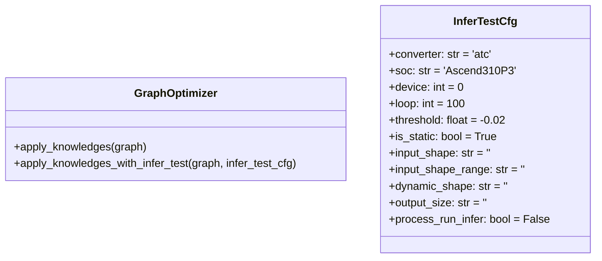

# Graph Optimizer

Graph Optimizer是直接承担onnx图优化的组件，指定需要使用的知识库进行构造，构造实例时，内部会对传入的知识库列表进行校验和排序，以尽量达到更好的优化效果。

## 优化流程

优化指定的onnx图时，构造使用的知识库会依次被应用，在每次优化前，都会深拷贝一次图，当优化失败（如知识库抛出异常或返回False）时，该优化会被舍弃，最终返回优化后的onnx图以及应用的知识库列表。当使用apply_knowledges_with_infer_test接口时，还会进行精度和性能测试（依赖CANN），当精度或性能达不到要求时，优化也会被舍弃。

## 类图



## 代码示例

```python3
import sys

from auto_optimizer.graph_optimizer import GraphOptimizer
from auto_optimizer.pattern import KnowledgeFactory
from auto_optimizer import OnnxGraph

if __name__ == "__main__":
    if len(sys.argv) < 3:
        sys.exit(0)
    input_path = sys.argv[1]  # 输入的onnx路径
    output_path = sys.argv[2] # 优化后的onnx输出路径
    knowledges = KnowledgeFactory.get_knowledge_pool()
    optimizer = GraphOptimizer(list(knowledges.keys()))

    graph_ori = OnnxGraph.parse(input_path)
    graph_opt, applied = optimizer.apply_knowledges(graph_ori)
    graph_opt.save(output_path)
    print(applied)
```
