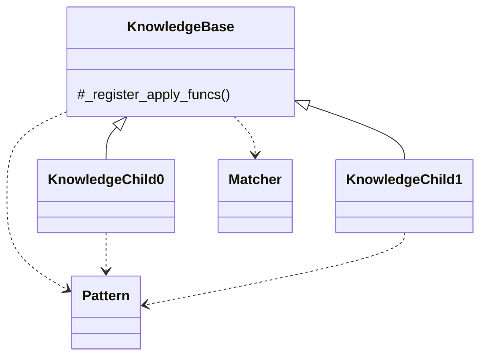
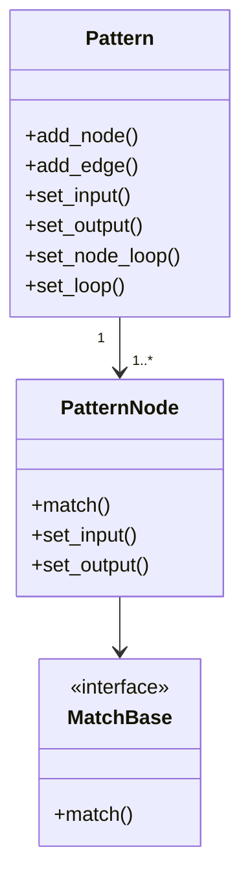
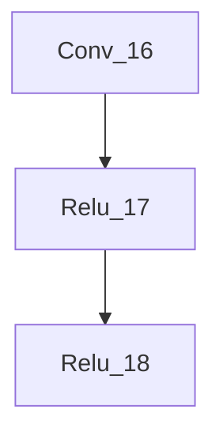
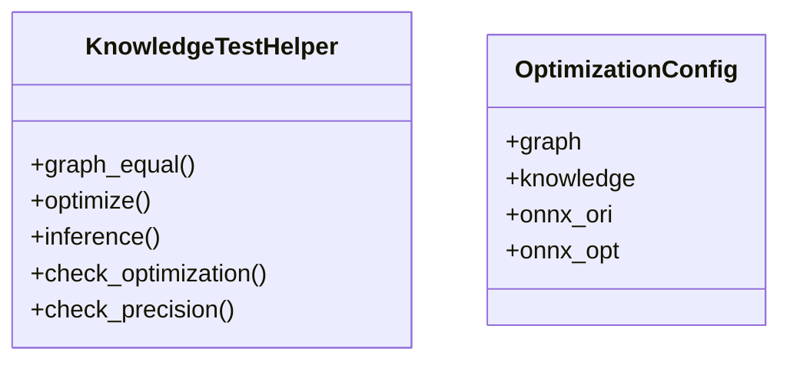

# 改图知识库应用说明

改图知识库主要是针对推理模型提供的自动改图的能力，目的是降低调优开发工作量，提高开发效率。

本章主要从开发和使用知识库两个维度展开说明，帮助开发者和使用者更快地入手改图知识库。

## 1. 如何写改图知识库

KnowledgeBase是改图知识库基类，它依赖Matcher实现子图匹配，依赖Pattern实现子图定义。



| KnowledgeBase名称        | 功能说明                                                     |
| ------------------------ | ------------------------------------------------------------ |
| __register_apply_funcs() | 注册pattern的apply方法，pattern是定义的子图，apply_funcs是子图对应的修改方法 |

KnowledgeBase基类还有一些其它的公共方法，参考第2章节，这里不再重复描述。

基于KnowledgeBase创建一个知识库子类，然后按一下步骤完成知识库：

1. 识别和梳理实际不合理的模型结构，进行泛华后定义成子图;
2. 根据子图，实现对应的apply修改方法；
3. 调用__register_apply_funcs()把修改方法注册到基类。

### 1.1 定义子图



PatternNode：算子节点

| PatternNode方法                         |                                                    |
| --------------------------------------- | -------------------------------------------------- |
| match(node: BaseNode, graph: BaseGraph) | 算子的匹配规则，包括对算子类型、属性、输入和输出等 |
| set_input(prev_node: PatternNode)       | 设置输入的节点                                     |
| set_output(next_node: PatternNode)      | 设置输出的节点                                     |

算子的匹配规则依赖于MatchBase接口，不同算子节点，根据自己的需求，实现MatchBase，每个算子可以有多个MatchBase实现。

| MatchBase方法      | 功能说明                                                     |
| ------------------ | ------------------------------------------------------------ |
| match(node, graph) | 算子匹配规则，node算子节点，BaseNode实例；graph计算图，BaseGraph实例 |

样例代码

```
class Conv1dMatch(MatchBase):
    def match(self, node: BaseNode, graph: BaseGraph) -> bool:
        if node is None:
            return False
        if not op.eq(node.op_type, 'Conv'):
            return False
        if len(node.inputs) > 1:
            weight = graph[node.inputs[1]]
            return len(weight.value.shape) == 3
        return False
```

Pattern：子图

| Pattern方法                                             | 功能说明                                                     |
| ------------------------------------------------------- | ------------------------------------------------------------ |
| add_node(op_name, op_types, op_matchs: List[MatchBase]) | 添加节点，op_name算子名，op_types支持的算子类型，op_matchs算子匹配规则 |
| add_edge(prev_op_name, next_op_name)                    | 添加边，prev_op_name前置算子，next_op_name后置算子           |
| set_input(op_name)                                      | 设置子图的输入算子                                           |
| set_output(op_name)                                     | 设置子图的输出算子                                           |
| set_node_loop(op_name, match_pattern)                   | 设置节点是否匹配多次，或者允许匹配零次                       |
| set_loop(match_pattern)                                 | 设置子图是否匹配多次，或者允许匹配零次                       |

考虑存在重复类型的算子或者允许算子可以不匹配等情况，通过方法set_node_loop()和set_loop()，设置match_pattern匹配模式：

- MATCH_ONCE：只匹配一次
- MATCH_ONCE_OR_MORE：匹配一次或者多次
- MATCH_ZERO_OR_MORE：匹配零次或者多次

```
# element_wise允许出现0次，或者多次
pattern = Pattern() \
    .add_node('Conv', ['Conv'], [Conv1dMatch]) \
    .add_node('element_wise', ['Mul', 'Add', 'Sub', 'Div', 'BatchNormalization', 'LeakyRelu', 'Relu']) \
    .add_edge('Conv', 'element_wise') \
    .set_input('Conv') \
    .set_output('element_wise') \
    .set_node_loop('element_wise', MATCH_PATTERN.MATCH_ZERO_OR_MORE) \
    .set_loop(MATCH_PATTERN.MATCH_ONCE_OR_MORE)
```

### 1.2 修改子图

同一个知识库，每个pattern可以有多种修改方法，不同知识库会有有不同的修改方法。

每个知识库开发自己的apply方法，然后调用基类的_register_apply_funcs()完成注册。

样例代码

```
class KnowledgeConv1d2Conv2d(KnowledgeBase):
    def __init__(self):
        super().__init__()
        # 注册pattern的apply方法
        self._register_apply_funcs(pattern, [self._conv1d2conv2d_apply])

    def _conv1d2conv2d_apply(self, graph: BaseGraph, match_result: MatchResult) -> bool:
        pass
```

conv1d2conv2d的apply方法有点复杂，资料里面就不粘贴出来了，大家打开代码自行阅读。

这里需要说明的是，apply方法会传入两个参数graph和match_result，这两个参数是固定的，不需要修改。

- graph：模型图，BaseGraph实例；

- match_result：子图匹配的结果，MatchResult的实例，可以直接访问里面的成员变量node_dicts；

node_dicts数据结构有些复杂，这里再对node_dicts的结构进行一下说明，方便开发者更好理解。

首先node_dicts是一个数组，它的每个元素是一个字典，每个字典包含一组节点，这些节点连接起来代表的就是一个子图，字典的key值是PatternNode的算子名，而value值是一个数组，包含零个、一个或者多个算子名，这里的算子名就是实际模型里面算子的名称。以一个实际的模型子图为例：



node_dicts的结果如下：

```
    [{
        'Conv': ['Conv_16'],
        'element_wise': ['Relu_17', 'Relu_18']
    }]
```

## 2. 如何测试改图知识库

写好了知识库后应该如何进行测试以保证知识库的正确性呢，框架提供了一个用于测试的helper类



| KnowledgeTestHelper方法  | 功能说明                                         |
| ------------------------ | ------------------------------------------------ |
| graph_equal()            | 判定两个计算图是否相等                           |
| optimize()               | 使用指定的知识库优化图，返回优化结果和优化后的图 |
| inference()              | 基于onnxruntime进行推理                          |
| check_optimization()     | 进行优化，并判断优化结果是否符合预期             |
| check_precision()        | 进行推理并判定两图推理结果是否等价               |

这里的接口定义了一些知识库测试常用的pattern，方便知识库测试使用。主要有测试优化成功和测试精度，宣称数学等价的知识库都应该通过这两个测试，如果不是数学等价的，则只需要通过优化成功这个测试。

知识库被认为优化成功需要进行两遍优化，第一次优化成功且图的结构被修改，第二次优化失败且图结构不变。这是因为已经优化了图不应该能够被再次优化。

精度判定方面，如果推理输出未产生溢出时，使用使用余弦距离小于一个阈值(默认1e-6)以及输出张量的模接近(atol=1e-8, rtol=1e-5)作为判定等价的依据，否则退而使用numpy.allclose。

OptimizationConfig是一个封装参数的类，其中graph是待优化的图，knowledge是使用的知识库，onnx_ori是原始onnx保存路径，onnx_opt是优化后onnx保存路径

使用时，让知识库的单元测试类同时继承unittest.TestCase和KnowledgeTestHelper即可使用。

关于这些接口的使用细节，请参见源代码以及现有知识库的单元测试。


## 3. 如何使用知识库

定义好了知识库之后，怎么应用？

考虑到知识库的复杂性，每个知识库可能会包含多个Pattern子图，而每个子图又可能对应多个apply方法，所以怎么遍历这些子图，采用哪种apply方法，对于最终模型能达到多大的性能提升，有着直接的影响。

参考迭代器的方式，在知识库基类KnowledgeBase中，提供了一些简单的用于遍历的方法：

| KnowledgeBase方法  | 功能说明                           |
| ------------------ | ---------------------------------- |
| has_next_pattern() | 是否有下一个子图                   |
| next_pattern()     | 指向下一个子图                     |
| has_next_apply()   | 基于当前子图，是否有下一个优化方法 |
| next_apply()       | 基于当前子图，指向下一个优化方法   |

将子图匹配和子图修改的公共逻辑提取在基类KnowledgeBase中，外部只需要循环调用如下两个接口，就可以运行完一个知识库

| KnowledgeBase方法          | 功能说明                                                     |
| -------------------------- | ------------------------------------------------------------ |
| match_pattern(graph)       | 根据定义的子图，在graph中查找匹配，返回一组MatchResult实例。 |
| apply(graph, match_result) | 对graph进行修改，**这是修改图的唯一入口**。方法内部会根据__build_pattern_apply_map()定义的映射关系，找到对应的优化方法，对graph进行修改。 |

样例代码

```
def optimize(graph, knowledge):
    res = False
    while knowledge.has_next_pattern():
        knowledge.next_pattern()
        match_results = knowledge.match_pattern(graph)
        if match_results is None or len(match_results) == 0:
            continue
        while knowledge.has_next_apply():
            knowledge.next_apply()
            for match_result in match_results:
                res |= knowledge.apply(graph, match_result)
    return res
```

