# 知识库列表

---

## 合并连续Concat算子(KnowledgeMergeConsecutiveConcat)

### 原理

有些onnx计算图内存在一些连续Concat算子，由于Concat算子可以接受任意个输入，当这些Concat算子合并的轴为同一个时，可以将这些连续的Concat算子合并成一个，以加快推理速度。

### 示意图

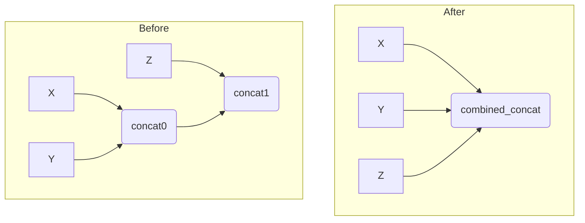

如图所示，concat0和concat1被合并为combined_concat，concat0和concat1的输入都作为combined_concat的输入。

---

## 合并连续Slice算子(KnowledgeMergeConsecutiveSlice)

### 原理

有些onnx计算图内存在一些连续Slice算子，由于Slice算子可以接受向量作为切片参数，当这些Slice算子切分的轴各不相同时，可以将这些连续的Slice算子合并成一个，以加快推理速度。

### 示意图

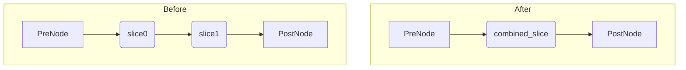

如图所示，slice0和slice1被合并为combined_slice，他们的切片参数被合并为combined_slice的切片参数。

---

## 拆分QKV结构内MatMul算子(KnowledgeSplitQKVMatmul)

### 原理

在transformer等模型中，存在很多固定的MatMul+Reshape+Transpose+Gather组合，在满足一定的前提条件下，通过矩阵的分块乘法，将QKV结构内的矩阵乘法均分为若干条分支，可以提升计算图的并行度以及消除部分Transpose算子，达到加快推理速度的目的。

### 示意图

如下左边是修改之前，右边是修改之后的计算图。

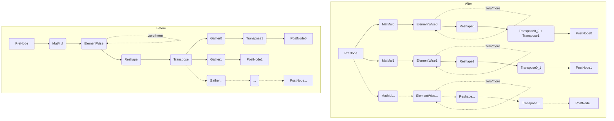

如图所示，左边是常见于transformer模型内的一种结构，矩阵乘法的结果通过Reshape/Transpose算子组合之后，被数个Gather算子平分。修改之后，MatMul算子被直接切分为若干个MatMul算子，不再需要Gather算子来做切分。

相对于特定的模型内的结构，这里对pattern主要做了两个泛化：

1. ElementWise算子可以是Add/Sub/Mul/Div四种，数量为M，M>=0
2. Gather算子数量为N，N>=2

根据矩阵乘法，为了能够拆分，子图还需要满足以下条件：

1. Reshape/Transpose/Gather的组合需要平分矩阵乘法的结果。
2. MatMul和Reshape算子的第二个输入必须是常数即Initializer，否则无法进行判断。
3. 子图中除了PreNode和PostNode节点外，均不能有额外的输出节点

示意图内的分支有两种，他们的区别是Gather算子后是否为transpose算子，在拆分后，Gather算子被消除，因此如果Gather算子前后均为Transpose算子，则这两个Transpose算子可以合并成一个，否则不需要特殊处理。

---

## 交换大shape卷积算子的H/W轴(KnowledgeTransposeLargeInputConv)

### 原理

部分音频模型中存在输入形状非常大的卷积算子，严重影响推理性能，利用NPU卷积操作中H轴相比W轴有更好的tiling策略的特点，我们交换卷积算子的H轴和W轴，从而大幅提升推理速度。目前该知识库只适用于下面特定的子图结构。

### 示意图

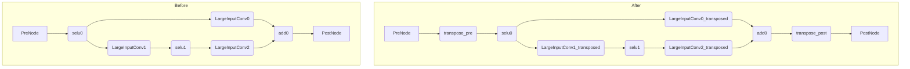

如图所示，我们在子图前后均加上Transpose算子，将子图中间的卷积算子均进行H/W轴转置，由于Selu算子不会改变输入输出的shape，所以不需要处理。

---

## 拆分大kernel卷积算子(KnowledgeSplitLargeKernelConv)

### 原理

部分音频和OCR模型中，存在卷积核特别大的卷积算子，严重影响推理速度。通过将该卷积算子通过Slice+Conv+Unsqueeze+Concat+ReduceSum组合拆分成多个卷积算子，可以有效提升推理速度。

### 示意图

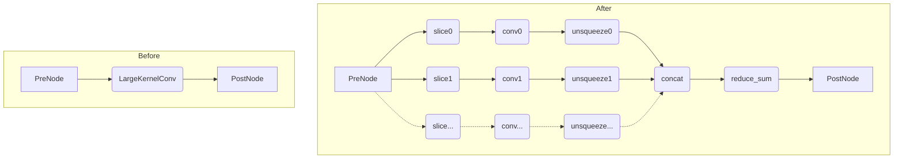

如图所示，我们将大kernel卷积算子根据kernel拆分为若干个，根据其kernel切片的移动范围将输入进行Slice切片，再将各个拆分后的卷积算子结果全部加起来，即得到了等效的结果。

---

## TopK算子输入输出类型修复(KnowledgeTopkFix)

### 原理

在ONNX标准中，TopK算子的输入K和输出indices其类型定义为int64[]，而在om的实现中为int32[]，由于ATC转换工具在某些情况下未正确处理这个问题，因此如果模型中存在TopK算子且其k或indices存在类型不匹配，则ATC有可能报错退出，无法转换该模型。这里通过对TopK算子相应的输入输出进行类型转换来处理这个问题。经过修改后，模型不再符合ONNX标准，因此仅推荐模型转换om时遇到TopK类型问题时才启用这个知识库。

### 示意图

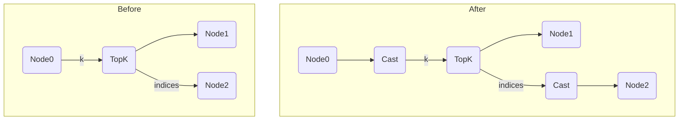

---

## 空slice修复(KnowledgeEmptySliceFix)

### 原理

ONNX标准中，Concat算子支持输入空张量，但是om的Concat算子实现某些情况下不支持，此时ATC转换会失败。一种已知的情况是输出空张量的slice算子和concat算子组合，本知识库通过删除该Slice算子，并根据前后的连接情况不同而做不同的处理，来规避这个问题。

### 示意图

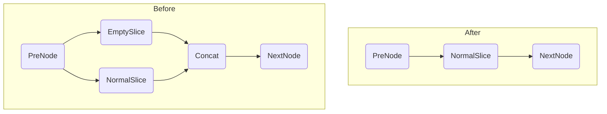
---

## Resize算子mode使用最近邻(KnowledgeResizeModeToNearest)

### 原理

部分推理模型中使用了双线性插值法做resize，经分析导致精度回归异常，使得各别图片存在误差。此类优化可扩展至linear->nearest、cubic->nearest、area->nearest等自定义转换场景。
### 可支持场景
Resize算子mode类型为linear、cubic、area的场景。 
### 示意图

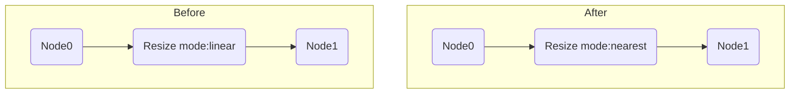
---

## Split算子替换Gather算子(KnowledgeGatherToSplit)

### 原理

部分推理模型中使用了多个Gather算子对同一个数据进行切分，经分析Gather算子indices连续的情况下，例如该场景：y1=x[:3]，y2=x[3:6]，y3=x[6:9]，可使用一个Split算子进行替换。
### 可支持场景
各Gather算子axis相同，indices为0开始的连续一维向量且切分数据不相交的场景。例如：三个Gather算子indices分别为[0]、[1]、[2]；三个Gather算子indices分别为[0, 1]、[2, 3]、[4, 5]。
### 示意图

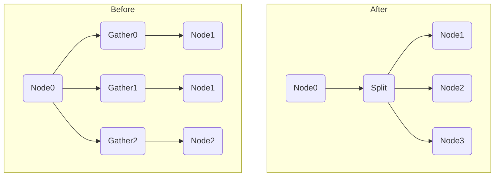

---

## 动态shape模型Reshape算子优化(KnowledgeDynamicReshape)

### 原理

由于动态shape模型的输入shape不固定，onnx模型中大部分Reshape算子的shape值需要在执行过程中计算得出。这就会导致两个问题：1、计算Reshape的shape值引入了很多小算子，增加了调度耗时；2、shape值未知，导致Reshape算子的infershape依赖前置算子的输出（Reshape的infershape需要等前置算子执行完才能开始），会打断调度流水。如果能够计算出Reshape的shape值，就可以减少很多非必须的算子，从而有效提高模型性能。Reshape算子有两个特性可以帮助我们实现：如果shape某一个轴大小没有变化，可以设置为0；如果输入只有一个动态轴，该轴可以赋值为-1。然后通过静态推导方法，对模型指定不同的固定输入，再根据Reshape算子推导出的输入和输出计算出该算子的shape值。

### 参数配置

因为动态shape模型输入存在差异，不同模型输入可接受的范围不同，需要用户手动配置动态轴的输入范围。可以打开配置文件auto_optimizer/model.cfg，修改input_shape_range值，动态轴的取值范围通过“~”符号的方式连接，如果动态轴是固定值的倍数，则需要在固定值后面加上“*”符号，详细的描述请移步model.cfg的配置说明。

### 示意图

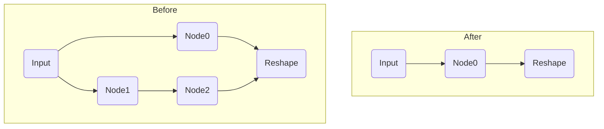

---

## AveragePool算子大kernel size和stride拆分(KnowledgeAvgPoolSplit)

### 原理

因为Ascend指令集的限制，AvgPool算子的kernel size最大不能超过255，如果超过会额外插入Transdata、Transpose等算子进行shape转换，导致性能下降。可以优化onnx模型，将AveragePool算子拆分成等价的多个串联的AveragePool算子，比如AveragePool("kernel_shape": [32, 64], "stride": [32, 64])，可以拆分成AveragePool_0("kernel_shape": [8, 16], "stride": [8, 16])和AveragePool_1("kernel_shape": [4, 4], "stride": [4, 4])，拆分后转成om模型，可以消除多余的Transdata、Transpose等算子。

### 示意图

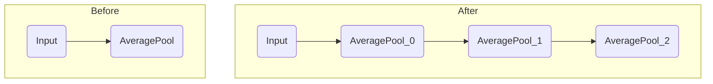

## Conv1d 转 Conv2d (KnowledgeConv1d2Conv2d)

### 原理

在 onnx 图转换为 om 图过程中，Conv1d 算子会转换为 Conv2d 算子，并在算子前后插入 Transdata 进行数据类型转换，图中的多个 Conv 算子就会导致多次数据类型转换引起性能损失。本知识库识别多个连通的 (Conv1d | Element-wise) 类型的算子为一个子图，并在子图的所有输入前插入 Unsqueeze 算子，所有输出后插入 Squeeze 算子将子图进行整体升维从而减少数据类型转换。

### 示意图

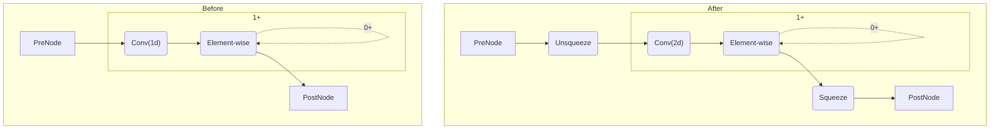

如图所示，Before 对应的是优化之前的 onnx 图，图中的 `Conv(1d) --> Element-wise` 结构代表由若干个 Conv 算子和 Element-wise 类型算子连通形成的子图。整个优化过程就是在子图的所有输入前插入 Unsqueeze 算子，所有输出后插入 Squeeze 算子将子图进行整体升维。

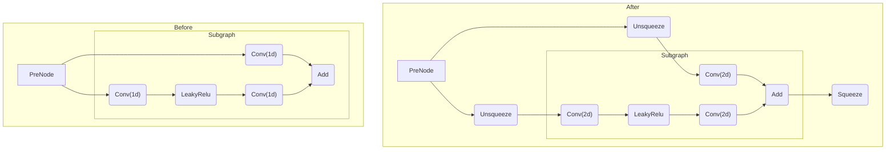

上图是一个更具体的示例，可以看到 Subgraph 中就是符合要求的子图，优化后子图的输入输出插入了 Unsqueeze 和 Squeeze 算子。

## 数据类型转换 (KnowledgeTypeCast)

### 原理

一些模型中使用了 int64 等较高精度的数据类型，实际模型并不需要这么高的精度进行推理，因此可以通过特定的类型转换策略对 onnx 图中的数据类型进行转换，从而提升图推理的性能。基本原理为找到 onnx 图中所有满足类型要求并可泛型的子图，通过在子图前后插入 Cast 算子将子图的数据类型转换为目标类型。

### 已支持场景

#### 已支持类型转换策略

后续可扩展为更复杂的转换策略

- int64 -> int32
- float64 -> float32

#### 已支持类型转换的算子

完全泛型算子：

- Mul
- Add
- Sub
- Div
- Abs
- Tanh
- LeakyRelu
- Relu
- Sigmoid
- BatchNormalization
- ReduceSum
- Concat
- Gemm
- Split
- Slice
- Transpose

半泛型算子：

- Expand: GenericIO([0], [0])
- Less: GenericIO([0, 1], [])
- Gather: GenericIO([0], [0])
- Shape: GenericIO([0], [])
- Where: GenericIO([1, 2], [0])
- Equal: GenericIO([0, 1], [])
- Reshape: GenericIO([0], [0])
- Tile: GenericIO([0], [0])
- ScatterND: GenericIO([0, 2], [0])
- Unsqueeze: GenericIO([0], [0])
- Squeeze: GenericIO([0], [0])

### 示意图

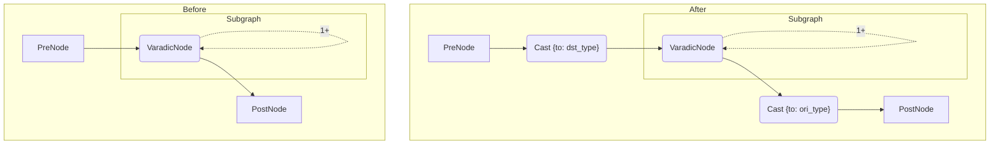

如上图所示，原图中存在满足匹配条件的子图，知识库通过在子图的所有输入前插入 `Cast {to: dst_type}` 算子，在输出后插入 `Cast {to: ori_type}` 算子，将子图内部的可泛型算子转换为目标类型。

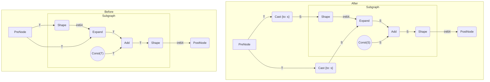

上图是一个更具体的示例，有几个细节需要注意：

1. 子图作为一个整体，只需要在子图的外部输入前插入 `Cast {to: s}` 算子，子图内部的可泛型算子也会转换为目标类型
2. Add 算子的常量输入节点内部的数据也会转换为目标类型
3. Shape 算子的输出不能泛型，因此 Shape 算子的输出作为图输出也不会插入 `Cast {to: T}` 算子

## Cast 算子合并 (KnowledgeMergeCasts)

### 原理

本知识库是对 KnowledgeTypeCast 知识库的一个补充优化，目的是合并图结构中多余的 Cast 算子，从而减少类型转换操作，也可以方便后续其他知识库进行结构合并。

### 示意图

Cast 算子合并可以归纳为以下三种方法：

1. 同属性的兄弟 Cast 算子合并

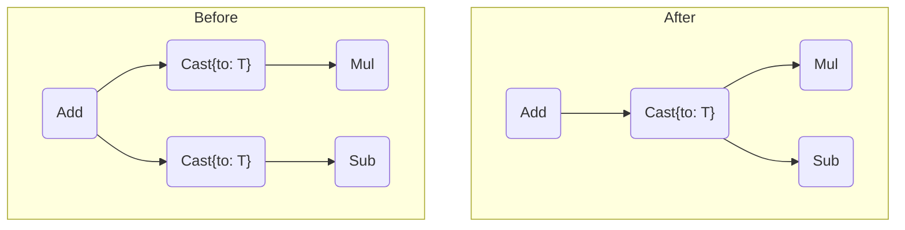

2. 单分支路径上的父子 Cast 算子合并

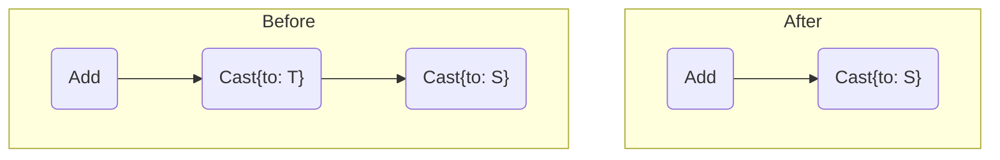

3. 根节点后的 Cast 算子如果与输出类型相同可以消除

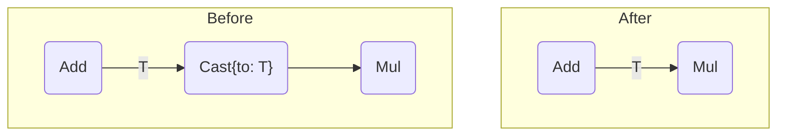

结合以上三种方法，对 Cast 节点树进行递归处理就可以合并多余的 Cast 节点

## BatchNormalization折叠 (KnowledgeBNFolding)

### 原理及示意图

BatchNormalization的数学表示如下：

$$
\mathbf{Y} = \frac{\mathbf{X} - \textrm{E}[\mathbf{X}]}{\sqrt{\textrm{Var}[\mathbf{X}] + \epsilon}} \times \gamma + \beta
$$

其中 $\mathbf{X}$ 为需要normalize的数据，shape为 $[N, C, D_1, D_2, ..., D_n]$ ， $\mathbf{Y}$ 为算子输出， $\textrm{E}[\mathbf{X}]$ 为输入均值mean， $\textrm{Var}[\mathbf{X}]$ 为输入方差var，$\gamma$ 为输入scale，$\beta$ 为输入bias，$\textrm{E}[\mathbf{X}], \textrm{Var}[\mathbf{X}], \gamma, \beta$ 的shape均为 $[C]$

其中的 $\epsilon$ 为BN的一个属性，是一个float常量

当前后有Transpose且两个Transpose可以互相抵消时，整个TR/BN/TR结构的数学表示可以写成：

$$
\mathbf{Y} = \left[\frac{\mathbf{X}^\mathsf{T} - \textrm{E}[\mathbf{X}]}{\sqrt{\textrm{Var}[\mathbf{X}] + \epsilon}} \times \mathbf{\gamma} + \beta \right]^\mathsf{T}
$$

化简为

$$
\mathbf{Y} = \mathbf{W} \times \mathbf{X} + \mathbf{B}
$$

其中

$$ \mathbf{W} = \left[\frac{\gamma}{\sqrt{\textrm{Var}[\mathbf{X}] + \epsilon}} \right]^\mathsf{T} $$
$$ \mathbf{B} = \left[\beta - \frac{\gamma \times \textrm{E}[\mathbf{X}]}{\sqrt{\textrm{Var}[\mathbf{X}] + \epsilon}} \right]^\mathsf{T} $$

因此当这里的输入 $\textrm{E}[\mathbf{X}], \textrm{Var}[\mathbf{X}], \gamma, \beta$ 都为常量时，可以进行常量折叠，将这里的TR/BN/TR组合替换为Mul/Add组合, $\mathbf{W}$ 和 $\mathbf{B}$ 分别为Mul和Add算子的输入。如图所示

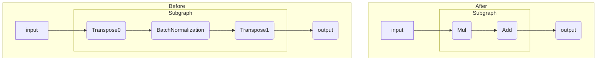

当没有Transpose时，FusionPass会进行一些类似Conv+BatchNormalization的融合，原理上是一样的，尝试了一些模型，部分性能有劣化，故不考虑。
