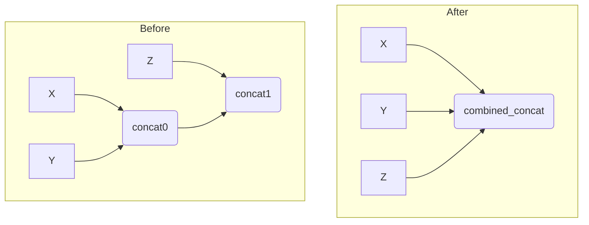
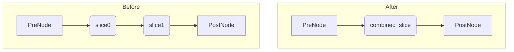
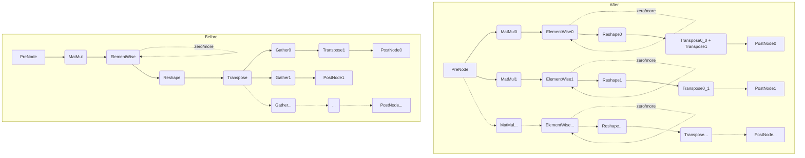
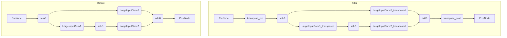
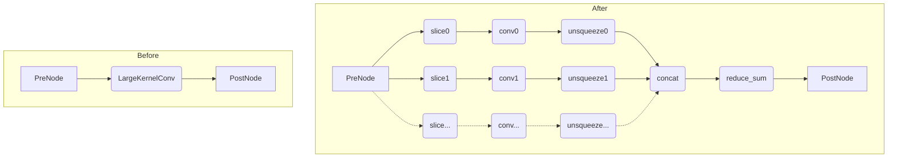
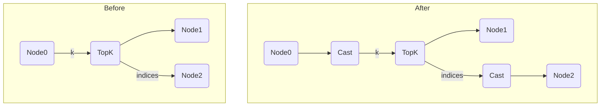
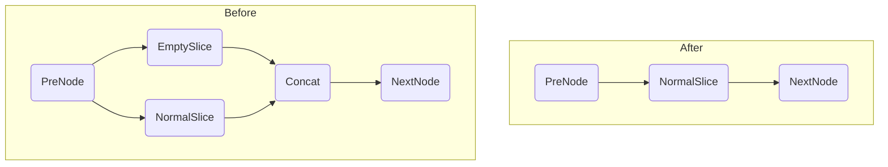
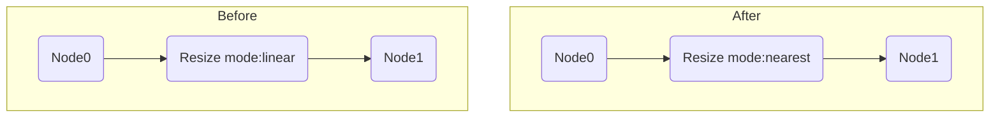

# 知识库列表

---

## 合并连续Concat算子(KnowledgeMergeConsecutiveConcat)

### 原理

有些onnx计算图内存在一些连续Concat算子，由于Concat算子可以接受任意个输入，当这些Concat算子合并的轴为同一个时，可以将这些连续的Concat算子合并成一个，以加快推理速度。

### 示意图

如图所示，concat0和concat1被合并为combined_concat，concat0和concat1的输入都作为combined_concat的输入。

---

## 合并连续Slice算子(KnowledgeMergeConsecutiveSlice)

### 原理

有些onnx计算图内存在一些连续Slice算子，由于Slice算子可以接受向量作为切片参数，当这些Slice算子切分的轴各不相同时，可以将这些连续的Slice算子合并成一个，以加快推理速度。

### 示意图

如图所示，slice0和slice1被合并为combined_slice，他们的切片参数被合并为combined_slice的切片参数。

---

## 拆分QKV结构内MatMul算子(KnowledgeSplitQKVMatmul)

### 原理

在transformer等模型中，存在很多固定的MatMul+Reshape+Transpose+Gather组合，在满足一定的前提条件下，通过矩阵的分块乘法，将QKV结构内的矩阵乘法均分为若干条分支，可以提升计算图的并行度以及消除部分Transpose算子，达到加快推理速度的目的。

### 示意图

如下左边是修改之前，右边是修改之后的计算图。

如图所示，左边是常见于transformer模型内的一种结构，矩阵乘法的结果通过Reshape/Transpose算子组合之后，被数个Gather算子平分。修改之后，MatMul算子被直接切分为若干个MatMul算子，不再需要Gather算子来做切分。

相对于特定的模型内的结构，这里对pattern主要做了两个泛化：

1. ElementWise算子可以是Add/Sub/Mul/Div四种，数量为M，M>=0
2. Gather算子数量为N，N>=2

根据矩阵乘法，为了能够拆分，子图还需要满足以下条件：

1. Reshape/Transpose/Gather的组合需要平分矩阵乘法的结果。
2. MatMul和Reshape算子的第二个输入必须是常数即Initializer，否则无法进行判断。
3. 子图中除了PreNode和PostNode节点外，均不能有额外的输出节点

示意图内的分支有两种，他们的区别是Gather算子后是否为transpose算子，在拆分后，Gather算子被消除，因此如果Gather算子前后均为Transpose算子，则这两个Transpose算子可以合并成一个，否则不需要特殊处理。

---

## 交换大shape卷积算子的H/W轴(KnowledgeTransposeLargeInputConv)

### 原理

部分音频模型中存在输入形状非常大的卷积算子，严重影响推理性能，利用NPU卷积操作中H轴相比W轴有更好的tiling策略的特点，我们交换卷积算子的H轴和W轴，从而大幅提升推理速度。目前该知识库只适用于下面特定的子图结构。

### 示意图

如图所示，我们在子图前后均加上Transpose算子，将子图中间的卷积算子均进行H/W轴转置，由于Selu算子不会改变输入输出的shape，所以不需要处理。

---

## 拆分大kernel卷积算子(KnowledgeSplitLargeKernelConv)

### 原理

部分音频和OCR模型中，存在卷积核特别大的卷积算子，严重影响推理速度。通过将该卷积算子通过Slice+Conv+Unsqueeze+Concat+ReduceSum组合拆分成多个卷积算子，可以有效提升推理速度。

### 示意图

如图所示，我们将大kernel卷积算子根据kernel拆分为若干个，根据其kernel切片的移动范围将输入进行Slice切片，再将各个拆分后的卷积算子结果全部加起来，即得到了等效的结果。

---

## TopK的indices输出类型修复(KnowledgeTopkIndicesTypeFix)

### 原理

在ONNX标准中，TopK算子的输入K和输出indices其类型定义为int64[]，而在om的实现中为int32[]，由于ATC转换工具在某些情况下未正确处理这个问题，因此如果模型中存在TopK算子且其k或indices存在类型不匹配，则ATC有可能报错退出，无法转换该模型。这里通过对TopK算子相应的输入输出进行类型转换来处理这个问题。经过修改后，模型不再符合ONNX标准，因此仅推荐模型转换om时遇到TopK类型问题时才启用这个知识库。

### 示意图

---

## 空slice修复(KnowledgeEmptySliceFix)

### 原理

ONNX标准中，Concat算子支持输入空张量，但是om的Concat算子实现某些情况下不支持，此时ATC转换会失败。一种已知的情况是输出空张量的slice算子和concat算子组合，本知识库通过删除该Slice算子，并根据前后的连接情况不同而做不同的处理，来规避这个问题。

### 示意图

---

## Resize算子mode使用最近邻(KnowledgeResizeModeToNearest)

### 原理

部分推理模型中使用了双线性插值法做resize，经分析导致精度回归异常，使得各别图片存在误差。此类优化可扩展至linear->nearest、cubic->nearest、area->nearest等自定义转换场景。

### 示意图

