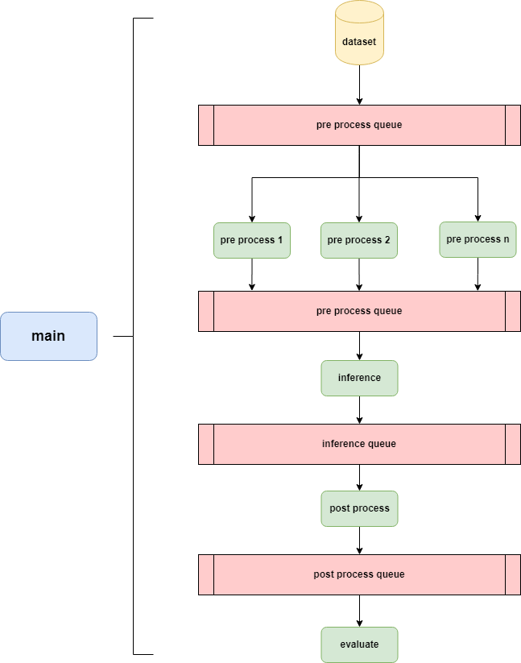

# 推理组件介绍

## 简介
inference_engine是一个包括推理全流程的组件库，推理端到端流程包含4个引擎，具体引擎如下所示：

- [x] pre process：数据预处理引擎
- [x] inference：离线推理引擎
- [x] post process：后处理引擎
- [x] evaluate：精度评测引擎

组件通过python多进程实现并行化离线推理，组件间通过队列实现数据通信，数据格式为numpy。

## 软件架构

组件采用注册机制，通过factory类提供的add接口实现引擎的注册，具体参考[data_process_factory.py](./data_process_factory.py)文件。



在[inference.py](../tools/inference.py)文件中实现了对组件功能的串接，采用multiprocessing中多进程和队列机制，实现了端到端的推理流程。

## 数据传输约束

数据队列建议存放数据格式：[[batch_file_name], [[batch_data_0], [batch_data_1], [batch_data_n]]]

- [x] batch_file_name：表示多batch时，对应数据集的文件名，用于精度评测
- [x] batch_data_n：表示第n个输出，batch_data_n包含batch组数据
- [x] 数据格式为numpy

## 预处理引擎

### 预处理介绍

对数据集进行数据处理，处理后的数据满足推理引擎要求。输出数据格式需满足数据格式要求。

示例代码参考[imagenet.py](./pre_process/vision/imagenet.py)

### 预处理API

- [x] 预处理注册接口

```python
def PreProcessFactory.add_pre_process(name, pre_process)
# name: 预处理名称，名称唯一，不能重复
# pre_process：预处理实现类，继承PreProcessBase类
```

- [x] 预处理实现接口

```python
def __call__(index, batch_size, worker, cfg, in_queue, out_queue)
# index: 预处理多进程序号，用于多进程唯一标识
# batch_size：数据batch_size，和模型一致
# worker：预处理进程数量
# cfg：预处理配置文件
# in_queue：输入队列，输入为None
# out_queue：输出队列
```

## 推理引擎
### 推理介绍
离线推理，输入预处理的数据，执行模型输出得到输出结果。

推理引擎包括如下两种方式：
- [x] onnxruntime离线推理
- [x] 昇腾pyacl离线推理

示例代码参考[onnx_inference.py](./inference/onnx_inference.py)

### 推理API

- [x] 推理注册接口

```python
def InferenceFactory.add_inference(name, inference)
# name: 推理名称，名称唯一，不能重复（比如acl、onnx推理）
# inference：推理实现类，继承InferenceBase类
```

- [x] 推理实现接口

```python
def __call__(loop, cfg, in_queue, out_queue)
# loop: 推理循环次数，根据数据集大小、batch_size及worker计算得到loop次数
# cfg：预处理配置文件
# in_queue：输入队列，前一个节点的输出，前一个节点一般指PreProcess
# out_queue：输出队列
```

## 后处理引擎
### 后处理介绍
大部分场景下后处理无需操作，数据直接透传接口。有一些场景下需要先对数据处理后再送精度评测引擎。
比如YOLO系列，大部分场景需要先对3层feature map处理（nms等）后再送精度评测引擎

示例代码参考[classification.py](./post_process/vision/classification.py)

### 后处理API

- [x] 后处理注册接口

```python
def PostProcessFactory.add_post_process(name, post_process)
# name: 后处理名称，名称唯一，不能重复
# post_process：后处理实现类，继承PostProcessBase类
```

- [x] 后处理实现接口

```python
def __call__(loop, cfg, in_queue, out_queue)
# loop: 推理循环次数，根据数据集大小、batch_size及worker计算得到loop次数
# cfg：预处理配置文件
# in_queue：输入队列，前一个节点的输出
# out_queue：输出队列
```

## 精度评测引擎
### 精度评测介绍
从后处理得到的数据（包括推理数据和文件名称），利用官方数据提供的功能实现数据集的评测。
示例代码参考[classification.py](./evaluate/vision/classification.py)

### 精度评测API

- [x] 精度评测注册接口

```python
def EvaluateFactory.add_evaluate(name, evaluate)
# name: 后处理名称，名称唯一，不能重复
# evaluate：后处理实现类，继承EvaluateBase类
```

- [x] 精度评测实现接口

```python
def __call__(loop, batch_size, cfg, in_queue, out_queue)
# loop: 推理循环次数，根据数据集大小、batch_size及worker计算得到loop次数
# cfg：预处理配置文件
# in_queue：输入队列，前一个节点的输出
# out_queue：输出队列
```
