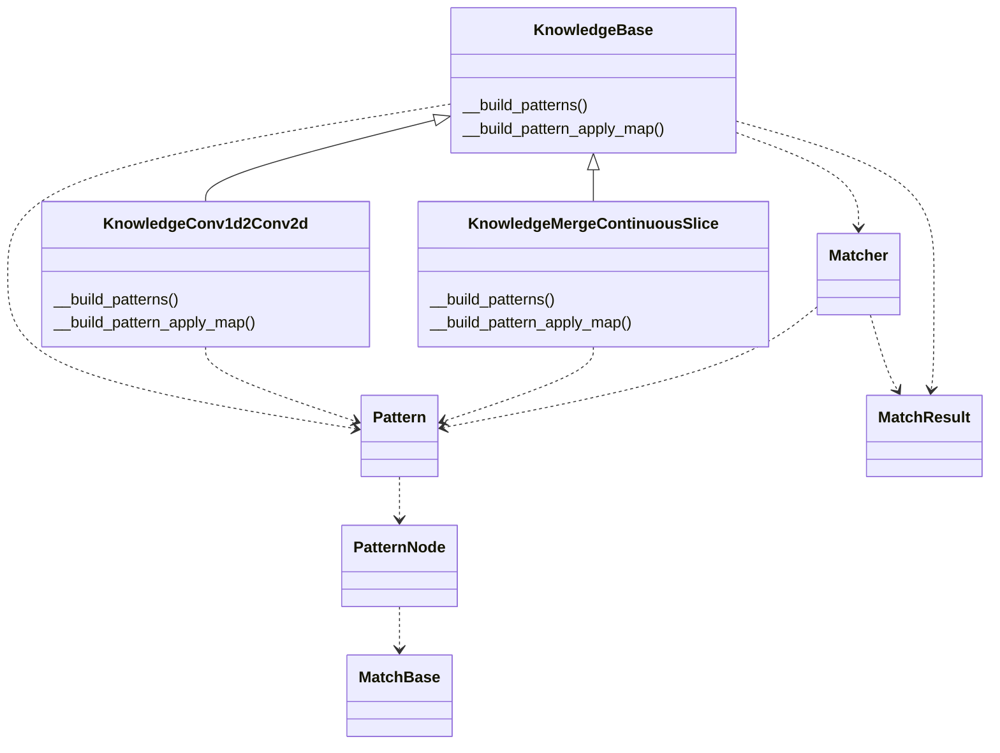

# 知识库API说明



类说明：

| 类名                          | 功能说明                                                     |
| ----------------------------- | ------------------------------------------------------------ |
| KnowledgeBase                 | 改图知识库基类                                               |
| KnowledgeConv1d2Conv2d        | 改图知识库，优化Conv1d，通过升维改成Conv2d                   |
| KnowledgeMergeContinuousSlice | 改图知识库，合并连续的Slice算子                              |
| Matcher                       | 通过深度优先搜索进行子图匹配                                 |
| MatchResult                   | 子图匹配的结果                                               |
| Pattern                       | 子图，包含添加节点、添加边、设置输入输出等方法，用于定义子图 |
| PatternNode                   | 子图算子节点，包含算子名、算子类型、以及一些匹配规则，这些匹配规则在基于MatchBase的子类中实现 |
| MatchBase                     | 算子节点需要对属性、输入、输出等做一些匹配，通过实现该接口，注册到PatternNode中 |

## KnowledgeBase API

KnowledgeBase是改图知识库基类，提供两个抽象方法\__build_patterns()和__build_pattern_apply_map()：

- __build_patterns()：定义子图；
- __build_pattern_apply_map()：定义子图和对应修改方法的映射关系；

| API名称                                        | 功能说明                         |
| ---------------------------------------------- | -------------------------------- |
| has_next_pattern()                             | 是否有下一个子图                 |
| next_pattern()                                 | 遍历下一个子图                   |
| has_next_apply()                               | 是否有下一个修改方法             |
| next_apply()                                   | 遍历下一个修改方法               |
| get_apply_ids()                                | 获取子图所有修改的方法的apply_id |
| set_apply_id()                                 | 根据apply_id配置对应的修改方法   |
| get_candidate_sub_graphs(graph, top_ops_names) | 匹配子图，返回子图匹配结果       |
| apply(graph, match_result)                     | 修改子图                         |

### 匹配子图

get_candidate_sub_graphs(graph, top_ops_names)

- 根据预先定义好的子图，在graph中进行查找匹配，返回匹配到的所有结果，匹配的结果是一组MatchResult实例。

- graph：计算图，BaseGraph实例；

  top_ops_names：算子列表，用于对匹配结果进行筛选，默认为None；

### 修改子图

apply(graph, match_result)

- 对计算图进行修改，修改的方法在改图知识库中定义，基类不感知具体的修改方法，只负责调用。

- graph：计算图，BaseGraph实例；

  match_result：子图匹配的结果，MatchResult实例；

## Matcher API

| API名称               | 功能说明                                     |
| --------------------- | -------------------------------------------- |
| get_candidate_nodes() | 获取候选节点                                 |
| get_match_map(node)   | 基于深度优先搜索进行子图匹配，node是起始节点 |

## MatchResult API

| API名称                  | 功能说明                                                     |
| ------------------------ | ------------------------------------------------------------ |
| add_node_dict(node_dict) | 添加匹配的子图，node_dict的key是PatternNode名称，value是一组BaseNode实例。node_dict的value存在多个的场景是PatternNode可以重复匹配多个。 |
| is_empty()               | 判断result是否为空                                           |

## Pattern API

| API名称                                | 功能说明                                                     |
| -------------------------------------- | ------------------------------------------------------------ |
| add_node(op_name, op_types, op_matchs) | 添加节点，op_name算子名，op_types支持的算子类型，op_matchs算子匹配规则，它是一组MatchBase子类的实例 |
| add_edge(prev_op_name, next_op_name)   | 添加边，prev_op_name前置节点名，next_op_name后置节点名       |
| set_input(op_name)                     | 设置输入的算子节点                                           |
| set_output(op_name)                    | 设置输出的算子节点                                           |
| set_node_loop(op_name, match_pattern)  | 设置节点是否匹配多次，或者允许匹配零次，match_pattern是枚举值 |
| set_loop(match_pattern)                | 设置子图是否匹配多次，或者允许匹配零次，match_pattern是枚举值 |
| get_visit_direction()                  | 获取子图遍历的方向，从上到下遍历，或者从下往上遍历，根据输入输出的节点个数决定 |
| get_start_node()                       | 获取子图遍历的起始节点                                       |
| node_cann_match_zero(op_name)          | 允许匹配零次                                                 |

### match_pattern匹配模式

- MATCH_ONCE：只匹配一次
- MATCH_ONCE_OR_MORE：匹配一次或者多次
- MATCH_ZERO_OR_MORE：匹配零次或者多次

## PatternNode API

| API名称               | 功能说明                                                     |
| --------------------- | ------------------------------------------------------------ |
| match(node, graph)    | 匹配节点，node算子节点，BaseNode实例；graph计算图，BaseGraph实例 |
| set_input(prev_node)  | 设置前置节点，prev_node前置节点，PatternNode实例             |
| set_output(next_node) | 设置后置节点，next_node后置节点，PatternNode实例             |

## MatchBase API

| API名称            | 功能说明                                                     |
| ------------------ | ------------------------------------------------------------ |
| match(node, graph) | 算子匹配规则，node算子节点，BaseNode实例；graph计算图，BaseGraph实例 |

Sample

```
class Conv1dMatch(MatchBase):
    def __init__(self):
        super().__init__()

    def match(self, node: BaseNode, graph: BaseGraph) -> bool:
        if node is None:
            return False
        if not op.eq(node.op_type, 'Conv'):
            return False
        if len(node.inputs) > 1:
            weight = graph[node.inputs[1]]
            return len(weight.value.shape) == 3
        return False

# element_wise允许出现0次，或者多次
pattern = Pattern() \
    .add_node('Conv', ['Conv'], [Conv1dMatch]) \
    .add_node('element_wise', ['Mul', 'Add', 'Sub', 'Div', 'BatchNormalization', 'LeakyRelu', 'Relu']) \
    .add_edge('Conv', 'element_wise') \
    .set_input('Conv') \
    .set_output('element_wise') \
    .set_node_loop('element_wise', MATCH_PATTERN.MATCH_ZERO_OR_MORE) \
    .set_loop(MATCH_PATTERN.MATCH_ONCE_OR_MORE)

@KnowledgeFactory.register("KnowledgeConv1d2Conv2d")
class KnowledgeConv1d2Conv2d(KnowledgeBase):
    def __init__(self):
        super().__init__()
        self._insert_op_names = set()

    def _build_patterns(self) -> List[Pattern]:
        return [pattern]

    def _build_pattern_apply_map(self) -> Dict[Pattern, List]:
        apply_dict = {
            pattern: [self._conv1d2conv2d_apply]
        }
        return apply_dict
 
    def _conv1d2conv2d_apply(self, graph, match_result: MatchResult) -> bool:
    	pass
```

