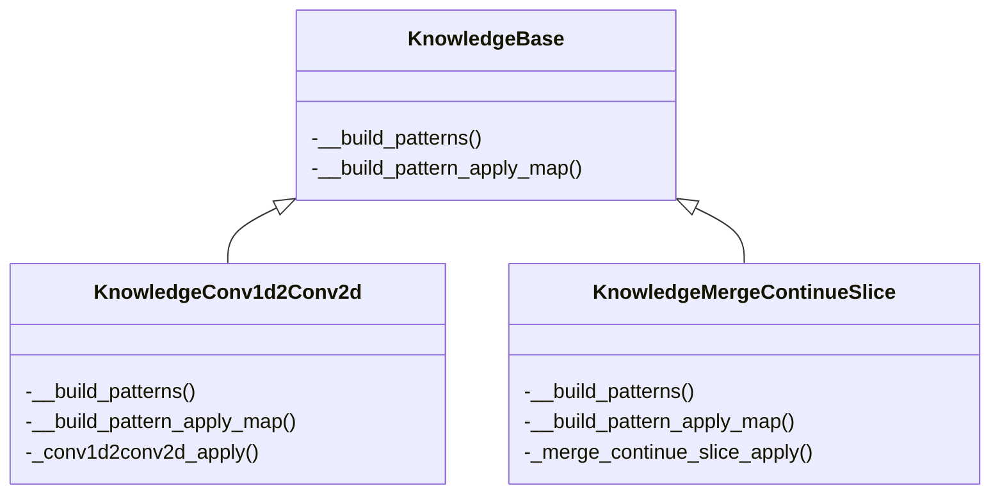
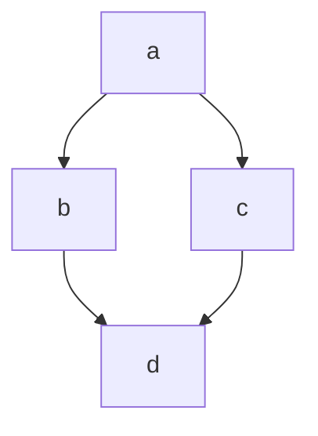
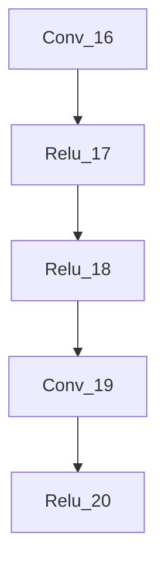

# 改图知识库应用说明

改图知识库主要是针对推理模型提供的自动改图的能力，目的是降低调优开发工作量，提高开发效率。

本章主要从开发和使用知识库两个维度展开说明，帮助开发者和使用者更快地入手改图知识库。

## 1. 如何写改图知识库

KnowledgeBase是改图知识库基类，以两个改图知识库为例，他们的类关系如下：



| API名称                       | 功能说明                                                     |
| ----------------------------- | ------------------------------------------------------------ |
| __build_patterns()            | 抽象方法，定义一个或多个子图                                 |
| __build_pattern_apply_map()   | 抽象方法，定义子图和对应修改方法的映射关系，不同子图的优化方法不同，一个子图可能有多种优化方法 |
| _conv1d2conv2d_apply()        | 子图优化方法，优化Conv1d到Conv2d                             |
| _merge_continue_slice_apply() | 子图优化方法，合并连续的Slice算子                            |

基于KnowledgeBase，创建一个子类，然后实现\__build_patterns()和__build_pattern_apply_map()方法。

__build_patterns()需要定义子图，那如何定义子图？

### 1.1 定义子图

子图是由若干算子节点和连接的边组成，子图的基本要素有：

- 算子节点
- 连边



除了以上要素以外，算子节点也有自己的一些属性、输入和输出等，还需要定义的基本要素有：

- 类型
- 属性
- 输入
- 输出

**那接下来开始定义一个子图：**

1. 创建一个Pattrern，通过add_node()增加节点，add_edge()增加连边，除此之外，Pattern还定义了一些其他方法，如下：

| Pattern方法名称                        | 功能说明                                                     |
| -------------------------------------- | ------------------------------------------------------------ |
| add_node(op_name, op_types, op_matchs) | 添加节点，op_name算子名，op_types支持的算子类型，op_matchs算子匹配规则，它是一组MatchBase接口实现的实例 |
| add_edge(prev_op_name, next_op_name)   | 添加边，prev_op_name前置节点名，next_op_name后置节点名       |
| set_input(op_name)                     | 设置输入的算子节点                                           |
| set_output(op_name)                    | 设置输出的算子节点                                           |
| set_node_loop(op_name, match_pattern)  | 设置节点是否匹配多次，或者允许匹配零次，match_pattern是枚举值 |
| set_loop(match_pattern)                | 设置子图是否匹配多次，或者允许匹配零次，match_pattern是枚举值 |

如果算子节点或者子图需要重复匹配，调用方法set_node_loop()和set_loop()，匹配模式match_pattern是枚举，有三种方式：

- MATCH_ONCE：只匹配一次
- MATCH_ONCE_OR_MORE：匹配一次或者多次
- MATCH_ZERO_OR_MORE：匹配零次或者多次

2. 定义算子的属性、输入和输出，考虑到不同算子属性、输入等的差异，这里定义了一个接口MatchBase。实现MatchBase，在接口方法match中，定义算子的匹配规则。

| MatchBase方法名称  | 功能说明                                                     |
| ------------------ | ------------------------------------------------------------ |
| match(node, graph) | 算子匹配规则，node算子节点，BaseNode实例；graph计算图，BaseGraph实例 |

样例代码

```
class Conv1dMatch(MatchBase):
    def __init__(self):
        super().__init__()

    def match(self, node: BaseNode, graph: BaseGraph) -> bool:
        if node is None:
            return False
        if not op.eq(node.op_type, 'Conv'):
            return False
        if len(node.inputs) > 1:
            weight = graph[node.inputs[1]]
            return len(weight.value.shape) == 3
        return False

# element_wise允许出现0次，或者多次
pattern = Pattern() \
    .add_node('Conv', ['Conv'], [Conv1dMatch]) \
    .add_node('element_wise', ['Mul', 'Add', 'Sub', 'Div', 'BatchNormalization', 'LeakyRelu', 'Relu']) \
    .add_edge('Conv', 'element_wise') \
    .set_input('Conv') \
    .set_output('element_wise') \
    .set_node_loop('element_wise', MATCH_PATTERN.MATCH_ZERO_OR_MORE) \
    .set_loop(MATCH_PATTERN.MATCH_ONCE_OR_MORE)

@KnowledgeFactory.register("KnowledgeConv1d2Conv2d")
class KnowledgeConv1d2Conv2d(KnowledgeBase):
    def __init__(self):
        super().__init__()
        self._insert_op_names = set()

    def _build_patterns(self) -> List[Pattern]:
        return [pattern]
```

### 1.2 定义优化方法

子图的优化方法是知识库的核心内容，针对子图进行修改达到性能提升的目的。

如何定义子图优化方法？这里有一定的限制，以conv1d2conv2d知识库为例：

**_conv1d2conv2d_apply(graph, match_result: MatchResult) -> bool**

- 方法名称可以任意定义，没有限制；

- 方法参数参考已有的知识库，需要支持的参数如下：

  graph：图，BaseGraph实例；

  match_result：子图匹配的结果，MatchResult的实例，可以直接访问里面的成员变量node_dicts；

node_dicts数据结构有些复杂，以一个实际的图为例：



根据子图的定义，匹配后的结果如下：

```
node_dicts数据结构:
	[
		{
			'Conv': ['Conv_16'],
			'element_wise': ['Relu_17', 'Relu_18']
		},{
			'Conv': ['Conv_19':BaseNode],
			'element_wise': ['Relu_20']
		}
	]
```

定义好优化方法之后，实现__build_pattern_apply_map()，构建子图和优化方法的对应关系。这样定义的好处是比较好做封装。

样例代码

```
@KnowledgeFactory.register("KnowledgeConv1d2Conv2d")
class KnowledgeConv1d2Conv2d(KnowledgeBase):
    def __init__(self):
        super().__init__()
        self._insert_op_names = set()

    def _build_patterns(self) -> List[Pattern]:
        return [pattern]

    def _build_pattern_apply_map(self) -> Dict[Pattern, List]:
        apply_dict = {
            pattern: [self._conv1d2conv2d_apply]
        }
        return apply_dict

    def _conv1d2conv2d_apply(self, graph, match_result: MatchResult) -> bool:
        pass
```

接下来就是完善改图知识库的优化方法_conv1d2conv2d_apply()。

## 2. 如何使用知识库

定义好了知识库之后，怎么应用？

首先说明一个前提：知识库会定义多个子图，每个子图可能对应多个优化方法。

基于以上前提，我们要遍历所有定义的子图，和子图对应的所有优化方法，参考迭代器的方式，提供了一些用于遍历的方法：

| KnowledgeBase方法名称 | 功能说明                           |
| --------------------- | ---------------------------------- |
| has_next_pattern()    | 是否有下一个子图                   |
| next_pattern()        | 指向下一个子图                     |
| has_next_apply()      | 基于当前子图，是否有下一个优化方法 |
| next_apply()          | 基于当前子图，指向下一个优化方法   |

如何对子图进行匹配？如何使用匹配的结果？提供了如下两个接口：

| KnowledgeBase方法名称           | 功能说明                                                     |
| ------------------------------- | ------------------------------------------------------------ |
| get_candidate_sub_graphs(graph) | 根据定义的子图，在graph中查找匹配，返回一组MatchResult实例。 |
| apply(graph, match_result)      | 对graph进行修改，**这是修改图的唯一入口**。方法内部会根据__build_pattern_apply_map()定义的映射关系，找到对应的优化方法，对graph进行修改。 |

样例代码

```
def optimize(graph, knowledge):
    res = False
    while knowledge.has_next_pattern():
        knowledge.next_pattern()
        match_results = knowledge.get_candidate_sub_graphs(graph)
        if match_results is None or len(match_results) == 0:
            continue
        while knowledge.has_next_apply():
            knowledge.next_apply()
            for match_result in match_results:
                res |= knowledge.apply(graph, match_result)
    return res
```