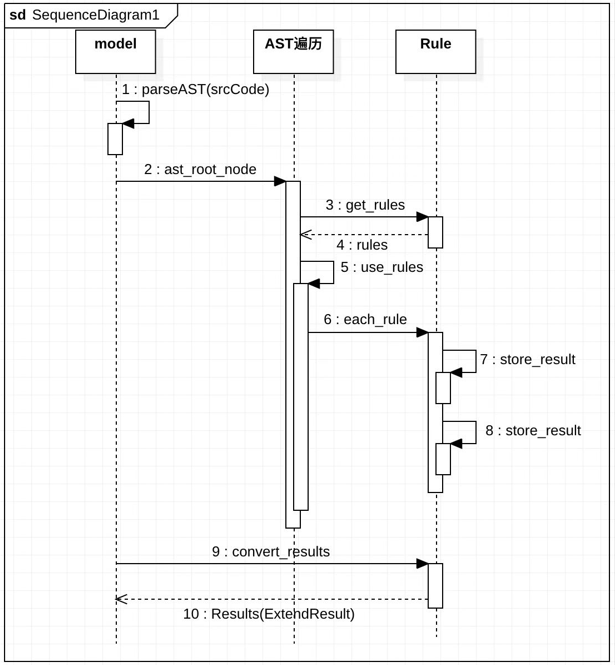

# DSL/TIK算子优化接口结构设计

## 1. 任务目标

**内容**

识别DSL/TIK算子开发过程中，算子实现逻辑、API使用方式不合理导致性能问题。

**输入输出**

输入： 

1. 算子实现代码
2. 环境变量等可获取的原始数据

输出：

1. 问题定位：算子开发异常导致的性能问题
2. 优化建议：如何优化算子代码

**要求**

准确率：90%

性能：1s

## 2. 目录结构

```
└-- ecosystem
    |-- ecosystem.json
    |-- optimizer
    |   |-- test                  # 测试模块
    |    	├─ main.py
    |    	└-- test_ops_file      # 测试算子实现文件
    |           └-- xxx.py
    |   |-- src
    |    	├─ local         # 语言
    |    	    ├─ zh.py
    |           └- en.py
    |    	├─ model.py      # 知识库
    |       ├─ constant.py   # 配置常量
    |       ├─ parse.py      # AST解析
    |       ├─ rules.py      # 优化建议的规则匹配方法
    |       ├─ result.py     # Result、ExtendResult
    |       ├─ node_visitor  # AST遍历
    |       └-- utils.py
    |   ├-- data
    |   |-- doc
    |       └-- 模型说明文档.md
    └   └-- requirement.txt
```

**constant.py**

配置知识库常量。

**parse.py**

解析算子实现代码的AST，遍历AST。

**rules.py**

实现的优化建议匹配规则，在`parse.py`遍历中调用这些规则。

**utils.py**

通用的工具函数。

### 2.1. 常量配置

定义于`constant.py`中。

```python
"""
	FILE: src/constant.py
"""

"""
DEBUG设置算子调优结果返回形式：
    - INFO     : 打印出可优化的建议(行号，修改建议)
    - RESULT   : 以ExtentResult返回
    - ALL      : 打印结果并以ExtendResult返回
"""
DEBUG = 'INFO'
FILE_PATH = './add.py'  # 需要自定义


class Advise:
    """
    算子优化建议的文本
    """
    class AvoidLongRuntimeInterface:
        message = '避免调用运行时间过程的接口'
        vrec2vdiv = f"<{message}> 可将取倒数计算改为除法计算"
        vexp2neg = f"<{message}> 可将分母中的指数运算中幂改为其相反数"

    class AvoidExcessiveWrappingFunction:
        message = '避免函数过多封装'
        
        ...
```

### 2.2. model.py

**evaluate()**

`evaluate`调优知识库调用起点

**parseAST(filepath)**

```python
def parseAST(filepath) -> ast.Node:
```

读取代码文件为字符串形式，然后生成其抽象语法树。然后先遍历一点，构建子节点指向其父节点的parent属性(因为有些优化需要访问其兄弟节点和父节点)，返回构建好的抽象语法树根节点。

## 3. 算子优化优化

### 3.1. 优化规则

本质上就是识别并打印出优化建议的函数，实现在`rules.py`文件中。

#### 3.1.1 @Rule装饰器

用于包装实现的一系列规则，将规则匹配到的结果进行后续处理，类似日志记录，将结果输出或者保存到类成员`results`，然后可通过类方法`convert_results`将`results`封装为`Result/ExtendResult`类型

```python
class Rule:
    results = []

    def __init__(self, debug='INFO', no=1, advice='避免调用运行时间过长的接口'):
        self.debug = debug
        self.no = no
        self.advice = advice

    def __call__(self, func):
        def decorate(*args, **kwargs):
            old, new = func(*args, **kwargs)
            if old is not None:
                if DEBUG == 'INFO':
                    self.info(old, new)
                elif DEBUG == 'RESULT':
                    self.result(old, new)
                elif DEBUG == 'ALL':
                    self.info(old, new)
                    self.result(old, new)
        return decorate

    def info(self, old, new):
        # 打印结果
        pass

    def result(self, old, new):
        # 保存中间结果
				pass
      
    @classmethod
    def convert_results(cls):
        # 封装为Result/ExtendResult
        res = convert_method(cls.results)
        return res
```

#### 3.1.2 规则匹配实现

用以下规则为例：

参数`node`为遍历到的AST节点。

1. 如果函数调用的名称为`vrec`，(行：9)
2. 那么将节点函数名称改为`vdiv`，(行：11)
3. 原来的参数作为新节点的第二个参数，(行：14)
4. 第一个参数构造一个常量`1`的节点。(行：13)

这样实现了`vrec(x) -> vdiv(1, x)`的修改建议。

> 对于这种较为简单的优化，可以给出修改前后的代码优化建议。

```python
@Rule(debug=DEBUG, no=1, advise=Advise.AvoidLongRuntimeInterface.vrec2vdiv)
def vrec2vdiv(node):
    """
    将倒数算子转换为除法
    Args:
        node: 遍历到节点
    Returns: 修改前后的ast节点
    """
    if node.func.attr == 'vrec':
        new_call = ast.Call(
            func=ast.Attribute(value=node.func.value, attr='vdiv', ctx=ast.Load()),
            args=[
                ast.Constant(value=1),
                node.args[0]
            ],
            keywords=[]
        )
        return node, new_call
    else:
        return None, None
```

#### 3.1.3 规则集合

在文件`rules.py`通过`get_rules_in_XXX`方法，返回所有规则，以便在AST遍历中实现插件式可拓展性。

```python
def get_rules_in_call():
    return [
        vrec2vdiv,
        vexp2neg
      	
      	...
    ]
```

### 3.2. AST遍历类

考虑到性能，最好一遍遍历能找出所有的可优化位置，所以优化查找在一个类方法中。

```python
class DslOptimizer(ast.NodeVisitor):
    def visit_Call(self, node):
        rules = get_rules_in_call() # 从rules.py中获取规则集合
        for detector in rules:      # 循环使用规则集合中的规则进行匹配
            detector(node)
        self.generic_visit(node)    # 递归遍历子节点
        
class TikOptimizer(ast.NodeVisitor):
    def __init__(self):
        # 读取硬件信息
        soc_version = 'Ascend910'
        tbe.common.platform.set_current_compile_soc_info(soc_version)
        self.cores = tbe.common.platform.get_soc_spec("CORE_NUM")
    
    def visit_Call(self, node: ast.Call):
        ...
```

继承`NodeVisitor`的类，重写 `visit_XXX`，会自动遍历查找`ast.XXX`类型的节点，然后循环使用规则集合中的规则进行匹配，最后调用`self.generic_node(node)`递归访问子节点。

### 3.3. ExtendResult

算子优化建议的结果以`table`类型返回，形式如下：

```
Line     : 问题出现的行号
Column   : 问题出现的列号
Origin   : 产生问题的原代码
Advice   : 优化建议
AdviceNo : 优化建议序号
```

| Line | Column | Origin            | Advice                                                   | AdviceNo |
| ---- | ------ | ----------------- | -------------------------------------------------------- | -------- |
| 9    | 4      | tbe.vrec(x)       | 避免使用运行时间较长的接口，可以将倒数运算改为除法运算。 | 1        |
| 15   | 0      | def func(x): .... | 减少函数封装，可以将函数改为内联实现。                   | 3        |

```python
extend_result.type = extend_type['table']

extend_result.data_type.append(extend_data_type['int'])
extend_result.data_type.append(extend_data_type['int'])
extend_result.data_type.append(extend_data_type['str'])
extend_result.data_type.append(extend_data_type['str'])
extend_result.data_type.append(extend_data_type['int'])

extend_result.key.append("Line")
extend_result.key.append("Column")
extend_result.key.append("Origin")
extend_result.key.append("Advice")
extend_result.key.append("AdviceNo")
```

## 4. 时序图

```
解析为AST => 用AST遍历类进行遍历
						=> 从rules中获取规则集合
						=> 使用所有规则进行匹配
								=> 匹配到的可优化中间结果保存下来
				 => 调用convert_results将结果封装为Result/ExtendResult
				 => 返回结果
```

