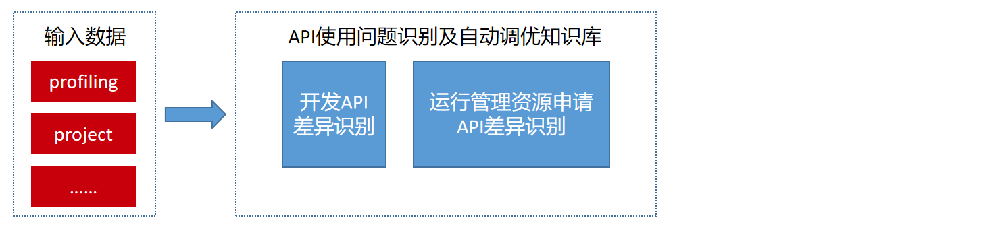

# 310迁移310P调优知识库

## 业务背景

昇腾310处理器硬件迁移至配置昇腾 310P处理器硬件的任务，在满足具体场景功能要求的基本前提下，需要关注整体性能目标的达成情况。
不同应用场景，对性能的要求往往是不同的，常见的推理性能指标包括时延、吞吐两项；建议在没有特殊要求的场景下，以吞吐作为迁移目标。
因此需要进行必要的前置分析，主要包括业务分析、硬件选型、软硬件兼容性评估、推理业务迁移流程等部分。


## 组件使用说明

- [x]  [运行环境调优知识库](#1-运行环境调优知识库)
- [x]  [API使用问题识别及自动调优知识库](#2-API使用问题识别及自动调优知识库)
- [x]  [代码逻辑错误识别及自动调优知识库](#3-代码逻辑错误识别及自动调优知识库)

## 安装教程

```shell
git clone https://gitee.com/ascend/msadvisor.git

```
## 1 运行环境调优知识库
### 知识库调优方向

### 数据准备
- [x] 将迁移代码路径通过ecosystem/running_env_tuning/RunningEnvTuning.json内的"target_file_address": ""进行配置。
### 命令行执行
```shell
msadvisor -c xxx/msadvisor/ecosystem/running_env_tuning/RunningEnvTuning.json 
-d xxx/msadvisor/ecosystem/running_env_tuning/data/knowledge

```
## 2 API使用问题识别及自动调优知识库
### 知识库调优方向

### 数据准备
- [x] 将profiling数据放到ecosystem/Api_optimization_suggestion/data/profiling路径下
- [x] 将工程文件数据放到ecosystem/Api_optimization_suggestion/data/project路径下
### 命令行执行
```shell
msadvisor -c xxx/msadvisor/ecosystem/Api_optimization_suggestion/model/ApiOptimizationSuggestion.json 
-d xxx/msadvisor/ecosystem/Api_optimization_suggestion/data

```
### 执行结果
#### 开发API差异识别  
python环境下，枚举数据类型aclvencChannelDescParamType中定义全部参数，应当输出所有参数的约束建议。解决迁移过程中数据类型中参数的约束问题。


#### 运行管理资源申请API差异识别  
Device管理&&Context管理&&内存管理：判断stream数量是否超过1024，若超过给出预警  
场景一：使用aclrtMemcpy接口，在使用aclrtMemcpy接口前使用了aclrtDeviceCanAccessPeer和aclrtDeviceEnablePeerAccess，使用规范无相关输出，解决迁移过程中Device的内存复制相关接口的使用约束问题
场景二：使用aclrtMemcpy接口，在使用aclrtMemcpy接口前使用了aclrtDeviceCanAccessPeer接口，未使用aclrtDeviceEnablePeerAccess接口，应输出建议使用aclrtDeviceEnablePeerAccess接口，解决迁移过程中Device的内存复制相关接口的使用约束问题

场景四：使用aclrtMemcpy接口，在使用aclrtMemcpy接口前未使用aclrtDeviceCanAccessPeer接口，使用了aclrtDeviceEnablePeerAccess接口，应输出建议使用aclrtDeviceCanAccessPeer接口，解决迁移过程中Device的内存复制相关接口的使用约束问题

场景五：使用aclrtMemcpy接口，未使用aclrtDeviceCanAccessPeer和aclrtDeviceEnablePeerAccess，应输出建议使用aclrtDeviceCanAccessPeer和aclrtDeviceEnablePeerAccess，解决迁移过程中Device的内存复制相关接口的使用约束问题


- [x] 媒体数据处理V1版本接口  
场景一：使用所有媒体数据处理V1版本接口，应输出所有接口的迁移建议。解决310-310p迁移过程中媒体数据处理V1版本接口的差异问题  

功能开发
- [x] 异步推理  
  testdata/Async/profiling/summary中的数据为模拟数据，查看知识库的输出。
  
场景一：使用aclmdlExecuteAsync接口实现异步推理，未使用aclrtSynchronizeStream接口阻塞Host运行，应输出使用aclrtSynchronizeStream接口的相关建议。解决迁移过程中异步推理相关接口的差异问题
			 
场景二：使用aclmdlExecuteAsync接口实现异步推理，使用aclrtSynchronizeStream接口阻塞Host运行，接口使用规范无相关输出。
- [x] 推理输入内存零拷贝  
场景一：使用acldvppMalloc接口，使用aclrtMemcpy，应输出不需使用DVPP内存的相关建议。解决迁移过程中推理输入内存零拷贝中DVPP内存使用问题  

## 3 代码逻辑错误识别及自动调优知识库
### 知识库调优方向

### 数据准备
- [x] 将profiling数据放到ecosystem/Api_optimization_suggestion/data/profiling路径下
- [x] 将aipp配置文件数据放到ecosystem/Api_optimization_suggestion/data/project路径下
### 命令行执行
```shell
msadvisor -c xxx/msadvisor/ecosystem/code_logic_error_identification_tuning/model/CodeLogicErrorIdentiTuning.json 
-d xxx/msadvisor/ecosystem/code_logic_error_identification_tuning/data/

```
### 执行结果

## 许可证

[Apache License 2.0](LICENSE)

## 免责声明

msadvisor仅提供调优参考，不对其质量或维护负责。
如果您遇到了问题，Gitee/Ascend/msadvisor提交issue，我们将根据您的issue跟踪解决。
衷心感谢您对我们社区的理解和贡献。
